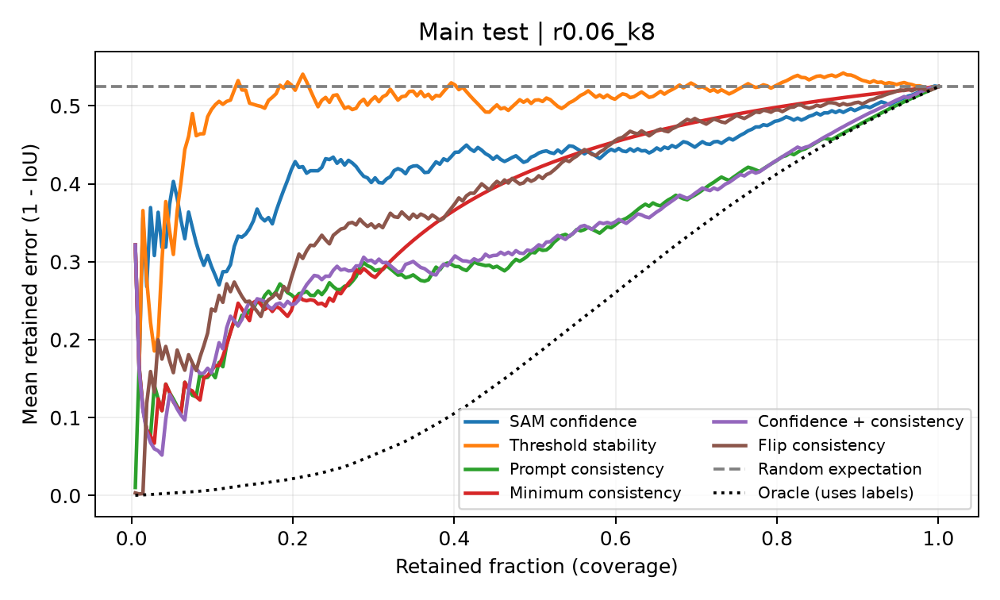
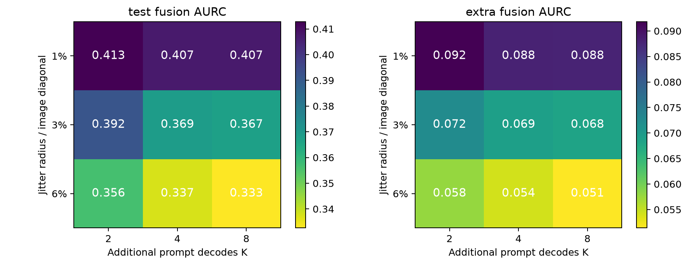
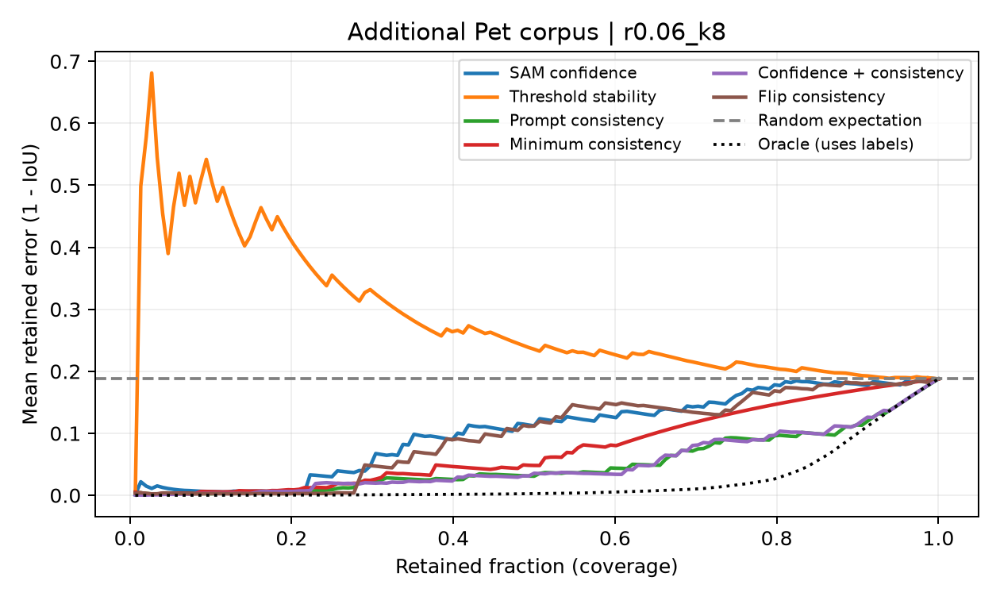
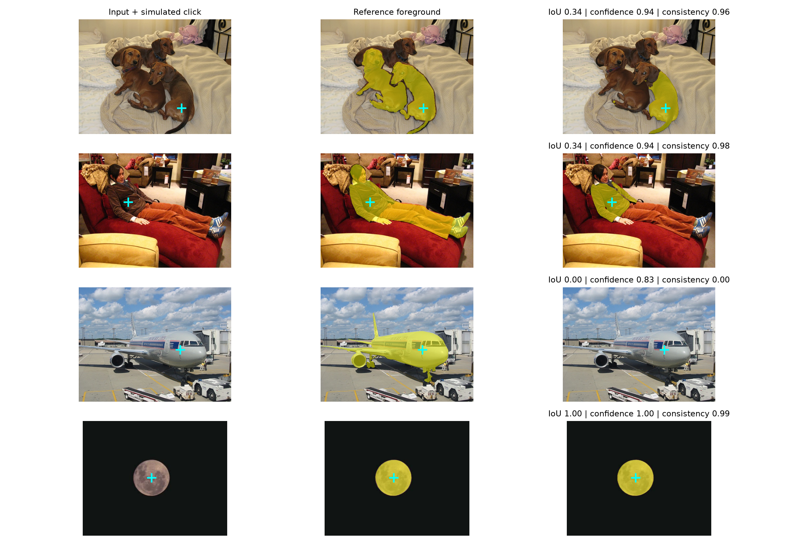

Training-Free Reliability Screening for Prompted Segmentation

Course project | SAM ViT-B, frozen weights | Natural-image failure screening

Abstract

We investigate whether prompt-response consistency identifies failures of a frozen Segment Anything Model without training an uncertainty estimator. A validation-only choice of perturbation radius and budget is evaluated on 106 held-out natural images (212 simulated click cases) and 74 separately downloaded Pet images (148 cases). Baselines include predicted IoU, threshold stability and horizontal-flip consistency; mean and minimum prompt consistency and a fixed confidence-consistency fusion are evaluated. The selected configuration is r0.06_k8. Main-set mean segmentation IoU is 0.475. On the main test set, fusion has lower AURC than SAM confidence: paired difference -0.0971 (95% image-bootstrap CI -0.1449 to -0.0528). The interval excludes zero. We find 2 stable failures under the predefined consistency >= 0.9 and IoU < 0.5 rule. The contribution is a reproducible empirical analysis with image-level uncertainty estimates, not a new backbone or a claim that consistency guarantees correctness.

1. Introduction

Interactive segmentation reduces annotation effort by letting a user specify a target with a click. However, the resulting mask may cover an object part, include nearby background, or select another plausible structure. A quality score is useful only if it ranks such failures. Repeating a segmentation under nearby prompts offers a simple test: do small prompt changes cause large output changes? This hypothesis is attractive because SAM can reuse one image embedding for many mask decodes. It also has a strong counterargument: a model can repeat the same mistake, and a perturbed click can accidentally specify a different object.

We therefore ask whether consistency helps beyond the model self-rating, how the result depends on click location and perturbation scale, and whether the added inference cost is justified. All methods score the same original mask. We keep failures and null findings in the analysis. This is a controlled simulated-click study rather than an evaluation of human interaction.

2. Related work

SAM [1] supplies pretrained segmentation and a predicted IoU head. PointPrompt [2] motivates studying prompting behavior, without implying that more prompts are always beneficial. UncertainSAM [3] trains a post-hoc uncertainty model and is outside our strict no-training protocol. Prompt-perturbation uncertainty has already been studied directly [4], including findings that differences may not survive paired comparisons. Our study independently implements a label-blind scorer and examines natural-image cases, budgets, radii, simulated click regimes and an additional Pet corpus. We do not claim to originate perturbation-based uncertainty.

3. Data and methodology

The main Oxford interactive segmentation corpus [5] contains 151 annotated images originating from GrabCut, PASCAL VOC and Alpha matting. A seeded shuffle assigns 45 images to validation and 106 to test, before generating any clicks. The extra corpus selects two official Pet test images per breed [6], for 74 images. Image identities, archive sources, hashes and preparation rules are saved. Extra images are internet-collected public data, not personally photographed images. Exact decoded-image duplicate checks prevent accidental overlap in our evaluated corpora; they cannot establish absence from SAM pretraining.

Main annotations map 255 to foreground, 0 to background and 128 to an ignored border. Pet trimaps map 1 to foreground, 2 to background and 3 to ignored border. Original image coordinates and dimensions are retained for evaluation. The foreground distance-transform maximum simulates an interior click. A seeded positive pixel within 2% of the image diagonal from the object boundary simulates a boundary click, with a logged interior fallback if that band is empty. Annotation-dependent simulation and diagnostics are separate from inference and scoring.

For each click, SAM generates three candidates; highest predicted IoU chooses the original prediction. The selection never uses annotation overlap. Eight fixed angular offsets define perturbations at radii 1%, 3% and 6% of the image diagonal. K=2 uses opposite offsets and K=4 uses cardinal offsets; K=8 uses all directions. Coordinates are clipped to the image. Perturbations are not repaired using reference masks. The fraction leaving the target is recorded for evaluation only.

3.1 Reliability scores

| Method | Higher-is-better score | Additional inference |
| --- | --- | --- |
| SAM confidence | Predicted IoU head | None |
| Threshold stability | Overlap at logits threshold +/- 1 | None |
| Mean / minimum consistency | Mean / minimum IoU(original, jitter mask) | K cached-embedding decodes |
| Fixed fusion | (clipped confidence + mean consistency) / 2 | K cached-embedding decodes |
| Flip consistency | IoU(original, inverse-flipped prediction) | One encoding and one decode |

All reliability functions are annotation-free. The original prediction is never changed. Confidence and fusion are ranking scores, not calibrated correctness probabilities. Empty-empty agreement is 1; an empty prediction against a valid nonempty target has true IoU 0. Empty threshold-stability denominator is assigned reliability 0, explicitly avoiding undefined division.

3.2 Evaluation protocol

Selective risk is mean (1 - true IoU) among retained cases, sorted by reliability. AURC averages that risk at each coverage k/n. Tied score groups use expected loss under random ordering within the group. Failure AUROC and average precision use risk = 1 - reliability; one-class subsets are undefined. Radius and K minimize validation fusion AURC, with lower K then radius as tie-breakers. Paired bootstrap resamples image IDs 2,000 times, keeping both prompt regimes together. Subgroup analyses are exploratory.

4. Main held-out results

Validation selected r0.06_k8 before held-out evaluation. The main test includes 106 images and 212 cases; 115 cases have IoU < 0.5. Full-coverage mean IoU is 0.475 and is identical across reliability methods, because masks are unchanged. Lower AURC is better; higher failure AUROC and average precision are better.

| Method | AURC | AUROC < .5 | AP < .5 | IoU @ 75% |
| --- | --- | --- | --- | --- |
| SAM confidence | 0.430 | 0.623 | 0.670 | 0.541 |
| Threshold stability | 0.502 | 0.491 | 0.531 | 0.480 |
| Mean prompt consistency | 0.329 | 0.803 | 0.846 | 0.589 |
| Minimum consistency | 0.377 | 0.690 | 0.663 | 0.511 |
| Confidence + consistency | 0.333 | 0.794 | 0.815 | 0.591 |
| Horizontal-flip consistency | 0.390 | 0.659 | 0.668 | 0.512 |

Figure 1. Main-test selective risk. The random line is expected performance without quality ranking; the oracle curve uses annotations and is not a deployable method. All practical methods rank the same masks.

On the main test set, fusion has lower AURC than SAM confidence: paired difference -0.0971 (95% image-bootstrap CI -0.1449 to -0.0528). The interval excludes zero.

Mean consistency alone has observed AURC 0.329, compared with fusion 0.333. Thus the study supports consistency-based screening beyond SAM confidence, but does not demonstrate an additional benefit from fusion over consistency alone.

Other paired comparisons against confidence, with image-cluster bootstrap: prompt-consistency AURC difference -0.1011 (95% image-bootstrap CI -0.1517 to -0.0547); flip-consistency AURC difference -0.0397 (95% image-bootstrap CI -0.0855 to +0.0031). AUROC differences and secondary IoU < 0.75 metrics are saved with the full results. These intervals quantify sample uncertainty within this protocol, not all deployment settings.

4.1 Sensitivity and additional corpus

Figure 2. Registered radius/budget sensitivity for fixed fusion. These held-out cells are descriptive; the primary configuration remains the validation choice, even if another test cell appears better.

The Pet corpus contains 74 images and 148 cases, with mean IoU 0.812. SAM confidence AURC is 0.103; fusion AURC is 0.051. The paired difference is -0.0512 (95% image-bootstrap CI -0.0840 to -0.0240). This is a second public corpus and does not prove generalization to unseen pretraining images.

Figure 3. Additional Pet-corpus selective risk, with the same frozen configuration and score definitions.

The selected perturbations leave the annotated target in an average fraction 0.294 on the main set and 0.254 on Pet. The all-inside diagnostic retains 85 main cases and 74 Pet cases. It helps distinguish sensitivity to the prompt from accidentally changing the target, but uses labels and is not part of a deployable scorer. Results by click regime, object size and confidence are supplied in summary.json.

Within main-test click regimes, confidence/fusion AURC is 0.372/0.280 for interior clicks and 0.495/0.419 for boundary clicks. In the all-inside diagnostic, main confidence/fusion AURC is 0.370/0.262. The observed improvement therefore persists descriptively within both click regimes and when no perturbation leaves the target; these restricted analyses do not establish a causal mechanism.

5. Failure analysis and discussion

Figure 4. Actual held-out predictions, annotated references and simulated clicks. Rows include stable failures when available, additional low-IoU cases and a successful case. Numerical captions show true IoU, SAM self-rating and prompt consistency.

Under the predefined rule, 2 main cases and 0 Pet cases are stable errors. Agreement measures repeatability, not semantic correctness. A mask may consistently identify a part rather than the annotated whole object. Conversely, a correct mask can be sensitive near an ambiguous boundary. Finite sample size, only one backbone, deterministic direction probes and annotation-defined click placement limit generalization. Ignored borders improve label validity but leave boundary quality only partially evaluated.

The full sweep computes more predictions than a deployment using the selected K. Five validation images separately benchmark true K=2,4,8 batches and flip inference; measured timings and the cost plot are included in the package. GPU timing is synchronized. Perturbation scoring reuses one embedding; flip consistency re-encodes the image. Any cost advantage must be interpreted together with ranking accuracy, not as evidence of better masks.

6. Conclusion

On the main test set, fusion has lower AURC than SAM confidence: paired difference -0.0971 (95% image-bootstrap CI -0.1449 to -0.0528). The interval excludes zero. The results answer a bounded research question about reliability ranking under simulated prompts. Further work should test human clicks, additional backbones and deployment shifts before treating any reliability score as a decision guarantee.

Individual contributions

Real team identities and actual contributions have not been provided. Each student must replace the pending entries in team.json with their name, student ID and verified work, and record their own presentation segment. Automated implementation does not certify the required individual work hours.

References

[1] A. Kirillov et al. Segment Anything. ICCV, 2023. https://arxiv.org/abs/2304.02643

[2] J. Quesada, M. Alotaibi, M. Prabhushankar and G. AlRegib. PointPrompt: A Multi-modal Prompting Dataset for Segment Anything Model. CVPR Workshops, 2024. https://openaccess.thecvf.com/content/CVPR2024W/PV/html/Quesada_PointPrompt_A_Multi-modal_Prompting_Dataset_for_Segment_Anything_Model_CVPRW_2024_paper.html

[3] T. Kaiser, T. Norrenbrock and B. Rosenhahn. UncertainSAM: Fast and Efficient Uncertainty Quantification of the Segment Anything Model. ICML, PMLR 267, pp. 28670-28688, 2025. https://proceedings.mlr.press/v267/kaiser25a.html

[4] S. Loke et al. When Does Prompt-Perturbation Uncertainty Catch Interactive-Segmentation Failures? MICCAI satellite open-access paper, UNSURE, 2026. https://papers.miccai.org/miccai-2026-sat/UNSURE2026_002.html

[5] V. Gulshan, C. Rother, A. Criminisi, A. Blake and A. Zisserman. Geodesic Star Convexity for Interactive Image Segmentation. CVPR, 2010. Dataset: https://robots.ox.ac.uk/~vgg/data/iseg/

[6] O. M. Parkhi, A. Vedaldi, A. Zisserman and C. V. Jawahar. Cats and Dogs. CVPR, 2012. Dataset: https://www.robots.ox.ac.uk/~vgg/data/pets/

Reproducibility

Seed: 20261003. Frozen selection: r0.06_k8. Device: cuda; PyTorch 2.8.0+cu128. Model SHA-256: ec2df62732614e57411cdcf32a23ffdf28910380d03139ee0f4fcbe91eb8c912. Raw sources, dependency versions, splits, per-case masks, validation selection and bootstrap output are saved in the project. No parameters were trained or updated.

The assignment gives inconsistent statements about proposal grading and an undated October 7 deadline; use the current course announcement for administrative details. The rehearsal video is an aid and does not satisfy the all-student speaking requirement.